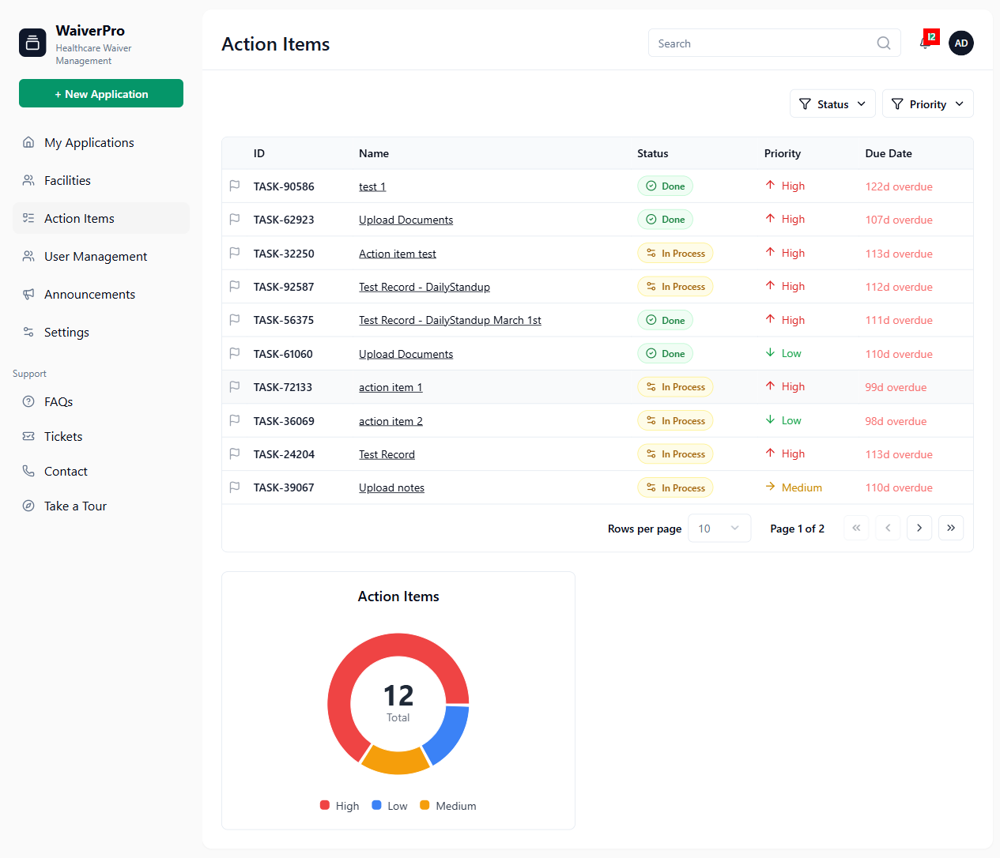
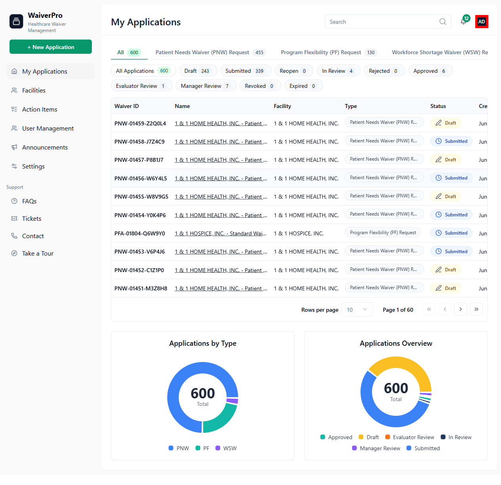
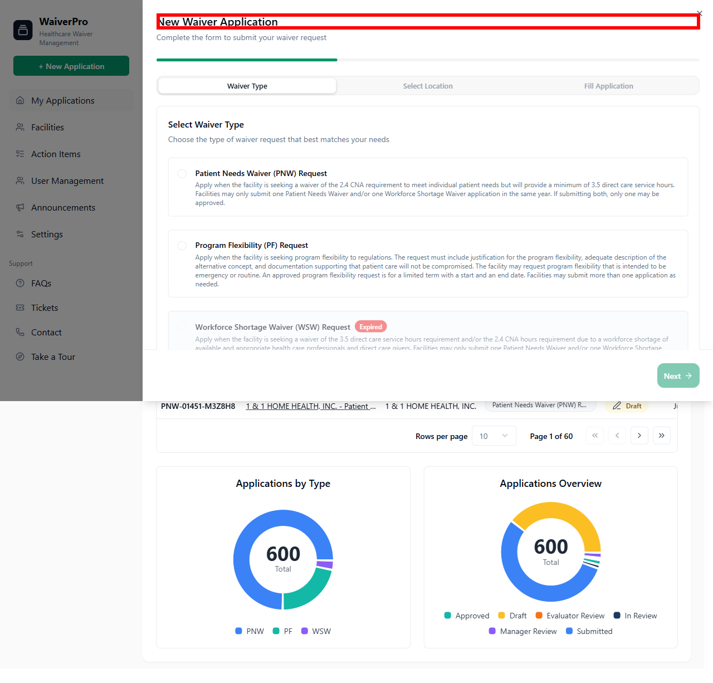

# WaiverPro AI Compliance Audit Report

## Executive Summary
- **Total Rules Evaluated:** 19
- **Compliant:** 7
- **Violations Detected:** 12

---

## Detailed Findings

### ❌ FAIL | Rule: The Search waivers must satisfy this condition: Search box filters the program list by name
**Reasoning:** No UI element resembling a 'Search box' that filters a program list by name was found among the provided elements. The existing elements include buttons for filtering by application status (e.g., 'Rejected', 'Approved', 'Revoked') and waiver type (e.g., 'Program Flexibility (PF) Request', 'Patient Needs Waiver (PNW) Request', 'Workforce Shortage Waiver (WSW) Request'), but not a general search input field.

---

### ❌ FAIL | Rule: The Sign In button must satisfy this condition: Located in the top-right corner of the landing page
**Reasoning:** No UI element with the visible text content 'Sign In' or clearly identifiable as a 'Sign In button' was found among the provided elements. Therefore, the rule cannot be evaluated.

---

### ✅ PASS | Rule: The Password field must satisfy this condition: Must be at least 6 characters
**Reasoning:** The UI element with visible text content 'Password must be at least 6 characters long' explicitly states the condition that the password must be at least 6 characters, which directly satisfies the rule.

---

### ✅ PASS | Rule: The Sidebar must satisfy this condition: Fixed on the left side of all signed-in pages
**Reasoning:** The navigation links, which are components of the sidebar, are consistently positioned at x=16 on both the 'dashboard' and 'profile' pages. This indicates that the sidebar is fixed on the left side of these signed-in pages, satisfying the rule.

---

### ❌ FAIL | Rule: The Header must satisfy this condition: Fixed along the top of all signed-in pages
**Reasoning:** No UI element identified as a 'Header' was found to be consistently fixed along the top of all signed-in pages. The elements with low y-coordinates (e.g., the '12' span at y=36 on the dashboard) are small and appear to be notification badges or part of other components, not a primary header spanning the page width. No common header element was found across the 'dashboard', 'profile', and 'support_tickets' pages at the top.

---

### ❌ FAIL | Rule: The + New Waiver Request button must satisfy this condition: Available from the sidebar on every page
**Reasoning:** The UI element with the visible text content '+ New Waiver Request' was not found in the provided list of elements. Therefore, compliance with the rule cannot be assessed.

---

### ❌ FAIL | Rule: The Notifications badge must satisfy this condition: Shows the number of outstanding action items
**Reasoning:** The UI element identified as a notifications badge displays '12', but there are only 6 outstanding action items ('In Process'). The badge should show '6' to comply with the rule.

**Visual Evidence:**

---

### ❌ FAIL | Rule: The Account avatar must satisfy this condition: Displays user initials and reveals email and Logout button
**Reasoning:** The account avatar, identified by the 'AD' initials, was found. It displays user initials as required. However, no UI elements representing the user's email address or a 'Logout' button were found among the extracted elements that could be revealed by the avatar. Therefore, the condition 'reveals email and Logout button' is not satisfied.

**Visual Evidence:**

---

### ✅ PASS | Rule: The Waiver-type tabs must satisfy this condition: Filters applications by All, PNW, PF, and WSW
**Reasoning:** The UI elements on the dashboard page include buttons for 'All Applications', 'Patient Needs Waiver (PNW) Request', 'Program Flexibility (PF) Request', and 'Workforce Shortage Waiver (WSW) Request'. These elements collectively satisfy the rule's requirement to filter applications by All, PNW, PF, and WSW.

---

### ❌ FAIL | Rule: The Status chips must satisfy this condition: Filters applications by Draft, Submitted, Reopen, In Review, Rejected, Approved, Evaluator Review, Manager Review, Revoked, and Expired
**Reasoning:** No UI elements identified as 'Status chips' that filter applications by the specified statuses (Draft, Submitted, Reopen, In Review, Rejected, Approved, Evaluator Review, Manager Review, Revoked, Expired) were found in the provided list. The extracted elements are all timestamps related to 'Updated' or 'Created' dates.

---

### ❌ FAIL | Rule: The New Waiver Application panel must satisfy this condition: Opens as a panel over the current page; includes progress bar and step tabs
**Reasoning:** The 'New Waiver Application' panel was identified by its title. However, the provided UI elements do not include any clear indicators of a 'progress bar' or 'step tabs' within the application process, which are required by the rule.

**Visual Evidence:**

---

### ❌ FAIL | Rule: The New Waiver Application steps must satisfy this condition: Must follow sequence: Waiver Type, Select Location, Fill Application
**Reasoning:** The rule states that the New Waiver Application steps must follow the sequence: 'Waiver Type, Select Location, Fill Application'. While 'Select Waiver Type' and 'Fill Application' elements were found, there is no UI element explicitly indicating a 'Select Location' step in the provided information. Therefore, the required sequence is not fully present.

---

### ✅ PASS | Rule: The Facilities Status Tracking must satisfy this condition: Can be toggled on or off under Settings -> Features
**Reasoning:** The 'Facilities Status Tracking' label is found on the 'settings' page, in close proximity to text that states 'Toggle experimental or upcoming features'. This indicates that 'Facilities Status Tracking' is a feature that can be toggled on or off under the 'Settings' page, satisfying the rule.

---

### ❌ FAIL | Rule: The Action Items table must satisfy this condition: Columns include ID, Name, Status, Priority, and Due Date
**Reasoning:** The rule requires the 'Action Items' table to have columns named 'ID', 'Name', 'Status', 'Priority', and 'Due Date'. While there are UI elements that appear to be data within a table (e.g., 'Done', 'In Process' for Status; 'High', 'Medium', 'Low' for Priority; 'action item 2', 'Action item test' for Name), there are no explicit UI elements provided that represent the column headers themselves. Without the column headers, it's impossible to verify if all the required columns are present and correctly named.

---

### ✅ PASS | Rule: The User Management tabs must satisfy this condition: Separates Members from Pending Invites
**Reasoning:** The UI elements 'Member ( 4 )' and 'Pending Invites' are present on the 'user_management' page and are clearly separated as distinct interactive elements. The 'Member' button is located at [x: 283, y: 116] and the 'Pending Invites' button (containing the span) is located at [x: 476, y: 122], indicating a clear horizontal separation.

---

### ❌ FAIL | Rule: The Support Ticket creation must satisfy this condition: Requires Title, Related Application, Category, Sub Category, Description, and file attachments
**Reasoning:** The provided UI elements display existing support ticket information (titles, descriptions, creation times) but do not include any input fields or controls for creating a new support ticket. Specifically, elements for entering a Title, selecting a Related Application, Category, Sub Category, providing a Description, or attaching files for a new ticket creation are missing from the extracted UI elements.

---

### ❌ FAIL | Rule: The Profile Information must satisfy this condition: Email field is read-only
**Reasoning:** No UI element explicitly identified as an 'Email field' within 'Profile Information' was found in the provided list. Therefore, it's not possible to verify if it is read-only.

---

### ✅ PASS | Rule: The Security (Change Password) must satisfy this condition: New password must be at least 6 characters long
**Reasoning:** The UI explicitly states "Password must be at least 6 characters long" on the settings page, which satisfies the rule for the 'New password' field within the 'Security (Change Password)' section.

---

### ✅ PASS | Rule: The FAQ Assistant Chatbot must satisfy this condition: Off by default in Settings
**Reasoning:** The UI element with text 'Show the AI FAQ assistant. Off by default to avoid loading it on every page.' explicitly states that the FAQ Assistant Chatbot is 'Off by default', which satisfies the rule.

---

