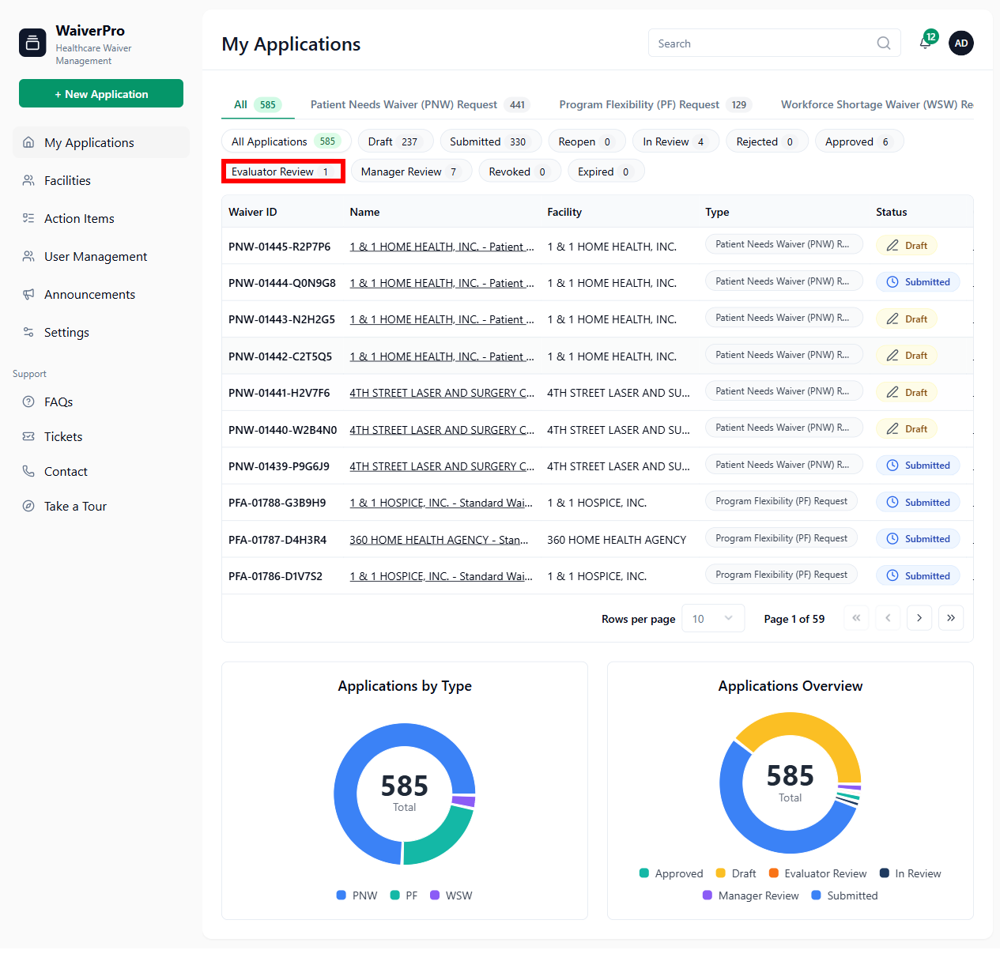

# WaiverPro AI Compliance Audit Report

## Executive Summary
- **Total Rules Evaluated:** 5
- **Compliant:** 2
- **Violations Detected:** 3

---

## Detailed Findings

### ✅ PASS | Rule: The Sidebar must satisfy this condition: Fixed on the left side of all signed-in pages
**Reasoning:** The 'My Applications' navigation link, which is a key component of the sidebar (located within an <aside> tag in the HTML hierarchy), is positioned on the left side of the page at x=16. This indicates that the sidebar itself is fixed on the left side of this signed-in page.

---

### ❌ FAIL | Rule: The + New Waiver Request button must satisfy this condition: Available from the sidebar on every page
**Reasoning:** The rule specifies 'The + New Waiver Request button'. No UI element with this exact text or a very similar generic 'New Waiver Request' button was found in the provided elements. The existing buttons are specific waiver types ('Workforce Shortage Waiver (WSW) Request' and 'Patient Needs Waiver (PNW) Request') and do not match the description of a single '+ New Waiver Request' button.

---

### ✅ PASS | Rule: The Waiver-type tabs must satisfy this condition: Filters applications by All, PNW, PF, and WSW
**Reasoning:** The UI contains buttons for 'All Applications', 'Patient Needs Waiver (PNW) Request', 'Program Flexibility (PF) Request', and 'Workforce Shortage Waiver (WSW) Request', which collectively satisfy the condition of filtering applications by All, PNW, PF, and WSW.

---

### ❌ FAIL | Rule: The Status chips must satisfy this condition: Filters applications by Draft, Submitted, Reopen, In Review, Rejected, Approved, Evaluator Review, Manager Review, Revoked, and Expired
**Reasoning:** The UI does not provide status chips for all required filters. Specifically, 'Draft', 'Submitted', 'Reopen', and 'Expired' status chips are missing from the available filters.

**Visual Evidence:**

---

### ❌ FAIL | Rule: The Action Items table must satisfy this condition: Columns include ID, Name, Status, Priority, and Due Date
**Reasoning:** The 'Action Items' table is implied by the presence of table cell elements and a navigation link, but the required column headers 'ID', 'Name', 'Status', 'Priority', and 'Due Date' were not found among the extracted UI elements.

---

